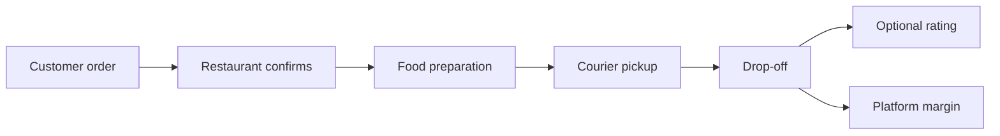
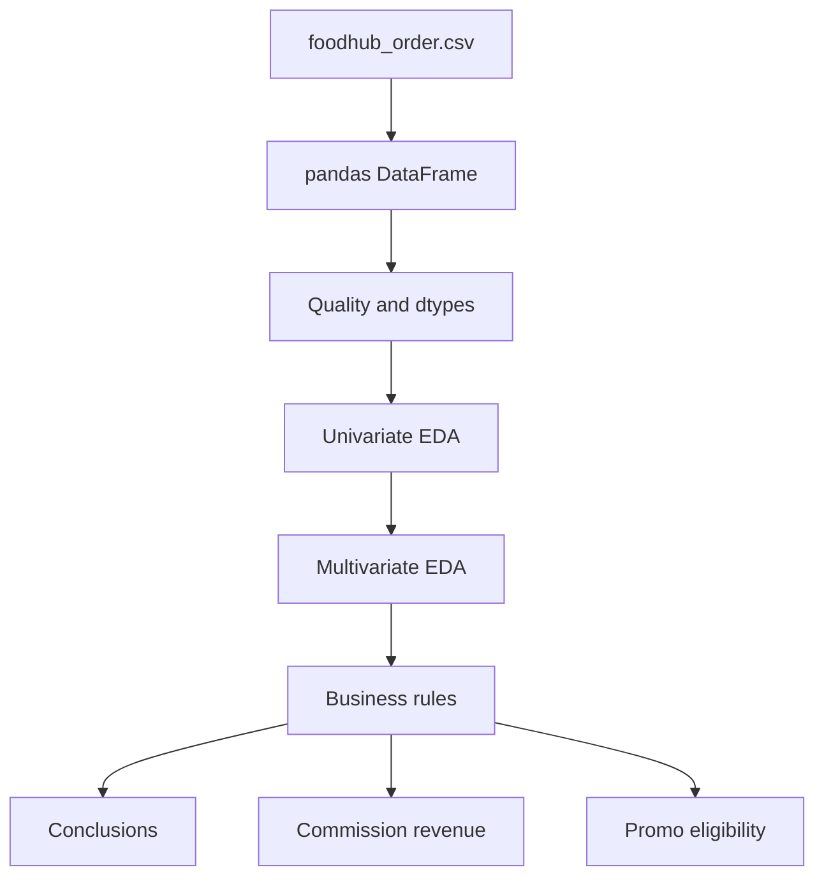

# FoodHub Data Analysis

[](https://github.com/sourojitd)
[](https://www.python.org/)
[](https://pandas.pydata.org/)
[](#key-findings)
[](https://sourojitd.github.io/AIML-Foodhub/)

<p align="center">
  
</p>

<p align="center">
  <strong>Built by Sourojit Dhua</strong> · Exploratory analysis of <strong>1,898</strong> FoodHub orders<br/>
  <a href="https://sourojitd.github.io/AIML-Foodhub/">Project site</a> ·
  <a href="index.html">Notebook (HTML)</a> ·
  <a href="Learner_Notebook_Full_Code_Sourojit_Dhua.ipynb">Notebook (.ipynb)</a>
</p>

---

## What this is

FoodHub is a New York food aggregator: customers order through one app, restaurants prep, couriers deliver, and the platform takes a margin. This project is a **Python Foundations** deep-dive into that order history — demand concentration, weekday/weekend ops, rating coverage, promo eligibility, and commission revenue.

I built the full analysis notebook end-to-end: load → quality → univariate/multivariate EDA → business questions → recommendations.

## Why it matters

Delivery platforms drown in tickets and still miss the levers that move margin and satisfaction. This analysis makes those levers explicit:

- Which restaurants earn promotional airtime
- How much the fee ladder actually yields
- Where end-to-end time breaks the 60-minute bar
- How weekend volume and weekday delivery drag diverge

## Key findings

| Signal | Result |
|--------|--------|
| Dataset | 1,898 orders × 9 fields · 0 nulls · 178 restaurants · 14 cuisines · 1,200 customers |
| Order economics | Mean cost **~$16.50**; mass in **$10–$20** |
| Times | Prep **20–35 min** (mean ~**27.4**); delivery **15–33 min** (mean ~**24.2**) |
| Demand shape | **~71%** weekend orders; American + Shake Shack lead volume |
| Ratings | **736** “Not given”; rated orders skew to **5** |
| Promo filter | rating count **> 50** and avg rating **> 4** → Shake Shack, The Meatball Shop, Blue Ribbon Sushi, Blue Ribbon Fried Chicken |
| Revenue | Tiered commission (**25%** if cost > $20; **15%** if $5 < cost ≤ $20) → **$6,166.30** |
| SLA | Prep + delivery **> 60 min** on **10.54%** of orders (**200**) |
| Ops | Weekday mean delivery **~5 minutes** slower than weekend |

## How an order moves



## Analysis architecture



## Topics / skills demonstrated

| Topic | What I did |
|-------|------------|
| **Data profiling** | `shape`, `info()`, null audits; dtype fitness; memory notes (`object` → `category` if scaled) |
| **Sentinel handling** | Treated rating `"Not given"` as a category — not silent NaN fill — before numeric aggregates |
| **Univariate EDA** | Histograms, boxplots, countplots for cost, times, cuisine, restaurant, day type, ratings |
| **Multivariate EDA** | Heatmaps + grouped boxplots; weak cost/time correlation; weekday delivery drag |
| **Business filters** | `groupby` + aggregate + boolean masks for promo eligibility |
| **Revenue logic** | Vectorized fee tiers with explicit float revenue column |
| **Derived SLA metric** | Prep + delivery; percentage over 60 minutes |
| **Decision writing** | Recommendations on ratings capture, loyalty, upsell ($10–$20), and partner rewards |

## Stack

- Python 3.x
- pandas · NumPy
- Matplotlib · Seaborn
- Jupyter Notebook

## Project structure

```text
├── foodhub_order.csv                              # Order dataset
├── Learner_Notebook_Full_Code_Sourojit_Dhua.ipynb # Full analysis
├── index.html                                     # Notebook HTML export
├── docs/                                          # GitHub Pages site
│   ├── index.html
│   └── assets/
├── README.md
└── Python notebook header graphic...webp
```

## Setup

```bash
git clone https://github.com/sourojitd/AIML-Foodhub.git
cd AIML-Foodhub
pip install pandas numpy matplotlib seaborn
```

Open `Learner_Notebook_Full_Code_Sourojit_Dhua.ipynb` and run top-to-bottom. Dataset path: `foodhub_order.csv` in the repo root.

Interactive walkthrough: **[sourojitd.github.io/AIML-Foodhub](https://sourojitd.github.io/AIML-Foodhub/)**

## Author

**Sourojit Dhua** · [@sourojitd](https://github.com/sourojitd)

Python data analysis · exploratory analytics · decision-ready storytelling
